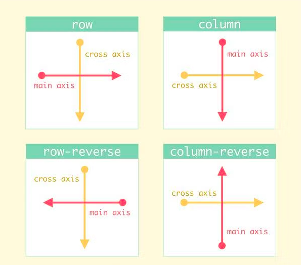
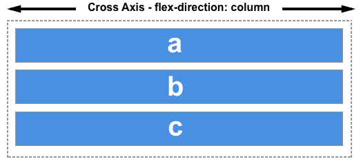

# FlexBox

- **_`Flexible Box`_;**
- **Modelo de _layout_ unidimensional;**
  - **Lida com o _layout_ em uma dimensão de cada vez (linha/coluna);**


### Eixos

- **As operações relacionadas ao _flexbox_, relacionam-se a dois eixos: o eixo principal e o eixo transversal;**

- **O eixo principal é definido através da propriedade `flex-direction` e o eixo transversal (o eixo cruzado) é o eixo que se encontra na direção perpendicular ao eixo principal;**

  


#### Eixo principal (main axis)

- **Corresponde ao eixo no qual os elementos (os _flex-items_), serão dispostos;**

- **Define através da propriedade `flex-direction`, que pode admitir os seguintes valores:**

  - **`row` (linha);**
  - **`row-reverse`;**
  - **`column` (coluna);**
  - **`column-reverse`;**

- **Se o valor escolhido for `row` ou `row-reverse`, o eixo principal será o eixo x (na horizontal);**

  

- **Agora, se o valor escolhido for `column` ou `column-reverse`, o eixo principal será o eixo y (na vertical);**

  

#### Eixo transversal/Eixo cruzado/Eixo secundário (cross axis)

- **É perpendicular ao eixo principal (logo, depende do eixo principal);**

- **Ou seja, se o valor definido para `flex-direction`, for `row` ou `row-reverse`, o eixo tranversal será o eixo y (na vertical);**

  

- **Agora, se tivermos: `flex-direction: column;` ou `flex-direction: column-reverse;`, o eixo transversal será o eixo x (na horizontal);**

  


### Flex-container

- **Para poder utilizar o modelo de _layout_ flexbox, precisamos definir um _flex-container_ (elemento que envolve todos os _flex-items_). Para isso, definimos a propriedade `display: flex;` para o _flex-container_;**

  ```html
  <!DOCTYPE html>
  <html lang="pt-BR">
    <head>
      <meta charset="UTF-8">
      <meta http-equiv="X-UA-Compatible" content="IE=edge">
      <meta name="viewport" content="width=device-width, initial-scale=1.0">
      <title>flex-container</title>
        <style>
            .flex-container {
                display: flex;
            }
        </style>
    </head>
    <body>
      <div class="flex-container">
        <div>1</div>
        <div>2</div>
        <div>3</div>
      </div>
    </body>
  </html>
  
  <!--
  	display: flex;
  		- Torna o elemento, um flex-container, enquanto os seus filhos, passam a ser flex-items; 
  -->
  ```

   

### Propriedades do _flex-container_

#### flex-direction

- **Define a direção na qual os _flex-items_ serão exibidos ao longo do eixo principal (basicamente, define o eixo principal). Valores;**
  - **`row` (padrão): em linha (os _flex-items_ são dispostos em linha, um ao lado do outro - da esquerda para direita);**
  - **`row-reverse`: os _flex_items_ também são dispostos em linha, um ao lado do outro, mas a agora, a ordem de exibição é invertida, o último elemento passa a ser o primeiro, o primeiro passa a ser último e assim sucessivamente (da direita para esquerda);**
  - **`column`: altera o eixo principal (que passa a ser o eixo y) e assim os _flex-items_ passam a ser exibidos em coluna (um abaixo do outro - de cima para baixo);**
  - **`column-reverse`: semelhante ao valor `column`, se diferenciando pelo fato da ordem de exibição dos _flex-items_, ser invertida (de baixo para cima);**

#### flex-wrap

- **Define se os _flex-items_ devem "romper" o _flex-container_ (na direção do eixo principal), quando o mesmo não "suportar" a quantidade de _flex-items_, ou se os _flex-items_ devem ser agrupados em uma nova linha, expandindo o _flex-container_. Valores;**
  - **`nowrap` (padrão): não permite a quebra de linha (com isso, pode ocorrer "vazamento", caso o a quantidade de _flex-items_ ultrapasse o tamanho do _flex-container_);**
  - **`wrap`: quebra a linha de forma automática, quando os _flex-items_ passam a ultrapassar o tamanho do _flex-container_ (eles são dispostos na linha abaixo);**
  - **`wrap-reverse`: semelhante ao valor `wrap`, mas aqui a quebra se dá na direção contrária (para a linha de cima - de baixo para cima);**

#### flex-flow

- **Um atalho/combinação (_shorthand_) para as propriedades `flex-direction` e `flex-wrap`. O primeiro valor a ser especificado corresponde a propriedade `flex-direction` e o segundo a propriedade `flex-wrap`;**

- **Sintaxe:**

  ```css
  flex-flow: flex-direction flex-wrap;
  ```

- **Geralmente, não é muito utilizado, já que quando utilizamos `flex-direction: column;`, mantemos o padrão do `flex-wrap` (`flex-wrap: nowrap`) e quando utilizamos `flex-wrap: wrap`, mantemos o padrão do `flex-direction` (`flex-direction: row`);**

#### justify-content

- **Utilizada para alinhar os _flex-items_ ao longo do eixo principal;**
- **OBS.: só funciona se os _flex-items_ não ocuparem todo o _flex-container_ (ao longo do eixo principal);**
- **Valores:**
  * **`flex-start | start` (padrão): alinha os _flex-items_ no início do _flex-container_;**
  * **`flex-end | end`: alinha os _flex-items_ ao final do _flex-container_;**
  * **`center`: alinha os _flex-items_ ao centro do _flex-container_;**
  * **`space-between`: cria espaçamentos de mesmo tamanho entre os _flex-items_, além de deixa o primeiro e o último, _flex-item_, colados no início e no final do _flex-container_, respectivamente;**
  * **`space-around`: cria espaçamentos entre cada _flex-item_ (os espaçamentos no meio, acabam sendo maiores do que os espaçementos no início e no final, do _flex-container_);**
    * **Dependendo da direção do eixo principal, esses espaçamentos podem ser aplicados como margens, esquerda e direita (no caso do eixo principal ser o eixo horizontal) e como margens, em cima e embaixo, topo e base (no caso do eixo principal ser o eixo vertical);**
  * **`space-evenly`: distribue os _flex-items_, de forma que os espaços que separam os _flex-items_ entre si, bem como os espaços que afastam o primeiro e o último _flex-item_, do início e do fim do _flex-container, respectivamente, sejam iguais (de mesmo tamanho);**

#### align-items

- **Utilizada para alinhar os _flex-items_ ao longo do eixo transversal (o eixo cruzado/secundário);**
- **OBS.: também só funciona se os _flex-items_ não ocuparem todo o _flex-container_  (ao longo do eixo cruzado);**
- **Valores:**
  - **`stretch` (padrão): faz com que os _flex-items_ passem a ter o mesmo tamanho (eles crescem igualmente, esticam), ocupando toda altura do container (correspondente as suas larguras);**
    - **O efeito (ocupar toda a altura do seu container pai) só será realmente aplicado, se os _flex-items_ não tiverem uma altura definida;**
  - **`flex-start | start`: alinha os _flex-items_ no início (do eixo cruzado);**
  - **`flex-end | end`: alinha os _flex-items_ ao final (do eixo cruzado);**
  - **`center`: alinha os _flex-items_ ao centro (do eixo cruzado);**
  - **`baseline`: alinha os _flex-items_ de acordo com a linha base da tipografia;**

#### align-content

- **Utilizada para alinhar as linhas dos _flex-items_ (como elas são distribuídas ao longo do eixo transversal/cruzado);**

- **OBSs.:**

  **1 - Essa propriedade não tem efeito em _flex-containers_ de linha única (os que possuem: `flex-wrap: nowrap;`);**

  **2 - Além disso, o _flex-container_ deve ser maior que o número total de linhas (precisamos definir uma altura para o _flex-container_);**

- **Valores:**
  - **`stretch` (padrão): os _flex-items_ crescem igualmente, na vertical;**
  - **`flex-start | start`: alinha todas as linhas no topo do _flex-container_;**
  - **`flex-end | end`: alinha todas as linhas na base do _flex-container_;**
  - **`center`: alinha todas as linhas ao centro;**
  - **`space-between`: cria espaçamentos de mesmo tamanho entre as linhas, mantendo a primeira e a última linha, coladas no topo e na base do _flex-container_, respectivamente;**
  - **`space-around`: cria espaçamentos ao redor das linhas (os espaçamentos do meio, acabam sendo duas vezes maiores do que os espaçamentos aplicados no topo e na base);**
  - **`space-evenly`: as linhas são distribuídas uniformemente ao longo do _flex-container_ (os espaços que as separam, são de mesmo tamanho);**

#### gap

- **Define o espaço entre as linhas e entre as colunas;**

  - **O espaçamento é aplicado aos itens que não estão nas bordas externas (primeiro e úlltimo, itens);**

- **Essa propriedade é um _shorthand_ para as propriedades `row-gap` e `column-gap` (propriedades que definem o espaço entre linhas e colunas, respectivamente);**

- **Além de funcionar com o _flexbox_, também funciona com o _grid_;**

  ```css
  .container {
      display: flex;
      
      ...
      ...
      
      /* 
      	Aceita um valor (row-gap e column-gap 
      	acabam assumindo o mesmo valor) ... 
      */
      gap: 10px;
      
      /* 
      	Ou dois valores (o primerio define o valor de
      	row-gap e o segundo o de column-gap)
      */
      gap: 10px 20px; /* row-gap column-gap */
      
      row-gap: 10px;
      column-gap: 20px;
  }
  ```

  

### Flex-items

- **São os elementos filhos do _flex-container_;**

### Propriedades dos _flex-items_

#### flex-grow 

- **Define o quanto um _flex-item_ irá crescer, em relação aos demais;**

- **OBSs.:**

  **1 - Por padrão, o valor é zero (assim os _flex-items_ ocupam o tamanho máximo relacionado ao conteúdo deles ou a largura que foi definida);**

  **2 - Ao definir o valor 1 para os _flex-items_, eles tentarão ocupar a mesma largura e vão ocupar 100% do _flex-container_ (dependendo do conteúdo de cada _flex-item_);**

  **3 - Exemplo: se tivermos 4 _flex-items_ em uma linha, e para três desses _flex-item_, definirmos `flex-grow: 1;`, enquanto para o _flex-item_ restante definirmos `flex-grow: 2;`, esse último _flex-item_ (de `flex-grow: 2;`), tentará ocupar duas vezes mais espaço do que os demais _flex-items_ (de `flex-grow: 1;`);**

  **4 - A propriedade _justify-content_, não funciona em _flex-items_ que possuem a propriedade `flex-grow` definida;**

- **Valores:**

  - **`flex-grow: algum_número;`;**
  - **`flex-grow: 0;` (valor padrão);**

#### flex-basis

- **Define o tamanho inicial que um _flex-item_ deve ter, antes que qualquer espaço ao seu redor (o espaço disponível), seja distribuído de acordo com outras propriedades;** 
  - **Essa propriedade define a largura e a altura mínima do _flex-item_, antes que ele seja redimensionado por outras propriedades;**

- **OBS.: Quando definido `flex-grow: 1;` e temos `flex-basis: auto;`, o valor restante para ocupar o _flex-container_, é distribuído ao redor do conteúdo do _flex-item_;**
- **Valores:**
  - **`flex-basis: auto;` (padrão): faz com que a largura da base, seja igual a do item;**
    - **Se o item não tiver um tamanho definido, o tamanho ficará de acordo com o seu conteúdo;**
  - **`flex-basis: valor;` (unidade: `%`, `em`, `px`, etc.);**
  - **`flex-basis: 0;`: se tivermos `flex-grow >= 1`, ele tentará manter todos os _flex-items_ com a mesma largura, independentemente do conteúdo (por isso o valor mais comum do `flex-basis` é o zero, caso contrário, o _flex-item_ acaba ficando com a largura referente ao seu conteúdo);**

#### flex-shrink

- **Define a proporção na qual um _flex-item_ deve encolher/ter o seu tamanho reduzido, conforme necessário, em relação aos demais _flex-items_;**
- **OBS.: Essa propriedade não aceita valores negativos;**
- **Valores:**
  - **`flex-shrink: 1;` (padrão): permite que os _flex-items_ tenham os seus tamanhos (seja esse tamanho definido a partir das propriedades _width_ ou _flex-basis_) reduzidos, para caber no _flex-container;**
  - **`flex-shrink: 0;`: não permite que os _flex-items_ tenham os seus tamanhos reduzidos. Por exemplo, um _flex-item_ definido com `flex-basis: 300px;`, nunca diminuirá menos do que _300px_, mesmo que o seu conteúdo não ocupe todo esse espaço;**
  - **`flex-shrink: algum_outro_número;`: um _flex-item_ definido com `flex-shrink: 3;`. diminuirá 3 vezes mais do que um _flex-item_ definido com `flex-shrink: 1;`;**

#### flex

- **Atalho (_shothand_) para as propriedades: _flex-grow_, _flex-shrink e _flex-basis_;**

- **Sintaxe:**

  ```css
  /* Sintaxe de valor único */
  flex: 5; <=> flex: 5 1 0; (valor válido para flex-grow)
  flex 250px; <=> flex: 1 1 250px; (valor válido para flex-basis)
  
  /* Sintaxe de dois valores */
  flex: 3 2; <=> flex 3 2 0; (valores válidos para flex-grow e flex-shrink)
  flex: 6 200px; <=> flex: 6 1 200px; (valores válidos para flex-grow e flex-shrink)
  
  /* Sintaxe de três valores */
  flex: flex-grow flex-shrink flex-basis;
  ```

- **OBSs.:**

  **1 - Geralmente aplicado a todos os _flex-items_, ao invés de ser aplicado de forma individual;**

  **2 - Para melhor consistência entre os _browsers_, é recomendado utilizar a propriedade `flex` ao invés de utilizar cada propriedade de forma separada;**

- **Valores:**
  - **`flex: 0 1 auto;` (padrão);**
  - **`flex: 1;`;**
    - **Define: `flex-grow: 1;`, `flex-shrink: 1;` e `flex-basis: 0;` (em alguns _browsers_ define como _0%_, pois nestes os valores sem unidades são ignorados, mas a função de 0 e _0%_ acaba sendo a mesma);**
  - **`flex: 2;`;**
    - **O mesmo que: `flex-grow: 2;`, `flex-shrink: 1;` e `flex-basis: 0;`;**
  - **`flex: 3 2 300px`;**

#### order

- **Altera a ordem de exibição dos _flex-items_ (sempre do menor para o maior, ou seja, um _flex-item_ com `order: 1;`, aparece na frente de um _flex_item_ com `order: 5;`);**
- **Valores:**
  - **`order: 0;` (padrão);**
    - **A ordem em que o _flex-item_ é exibido, é a ordem apresentada no HTML;**
  - **`order: algum_outro_número`;**
    - **Podemos aplicar um número negativo;**

#### align-self

- **Define o alinhamento, específico, de um _flex-item_;**
  - **Caso um valor seja atribuído, esse valor "passará por cima" (terá mais prioridade) do valor atribuído a propriedade _align-items_ do _flex-container_;**
  - **O alinhamento pode ocorrer, tanto em linha, como coluna;**
- **Valores:**
  - **`auto` (padrão): respeita o que foi definido na propriedade _align-items_, aplicado ao _flex-container_;**
  - **`flex-start`: alinha o _flex-item_ no início do _flex-container_ (topo/esquerda);**
  - **`flex-end`: alinha o _flex-item_ no final do _flex-container_ (base/direita);**
  - **`center`: centraliza o _flex-item_;**
  - **`stretch`: o _flex-item_ é esticado para ocupar toda a sua faixa no _flex-container_;**
  - **`baseline`: o _flex-item_ é alinhado a partir da base da primeira linha de texto dos demais;**


### OBSs.:

- **O _Flexbox_ é mais recomendado para componentes de uma aplicação e _layouts_ de pequena escala (o _Grid_ é recomendado para _layouts_ de grande escala);**
